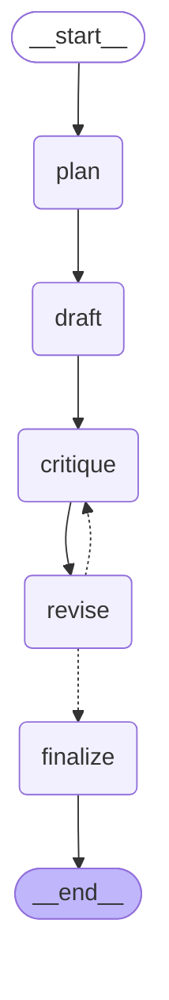

# 🔎 Autonomous Research & Report Agent

An agentic AI system that autonomously plans a research strategy, searches the web, drafts a report, critiques its own work, and revises it — built with LangGraph and the Gemini API.

**Live demo:** _(https://autonomous-research-and-report-agent-ke5on4xrmjdnsjvtqbradj.streamlit.app/)_


## What it does
Give it any topic, and it will:
1. **Plan** — break the topic into 3–5 specific sub-questions
2. **Research** — search the web to answer each sub-question, using an LLM-driven tool-calling loop (not hardcoded queries)
3. **Draft** — write a structured report with inline citations tied to real sources
4. **Critique** — review its own draft for unsupported claims and gaps
5. **Revise** — produce an improved final version, looping the critique step multiple times

## Architecture




## Why this is agentic, not just an API wrapper
- **Planning & task decomposition**: the model decides the research sub-questions itself, not hardcoded logic
- **Autonomous tool use**: the agent decides when and what to search for, in a loop, until it has enough information
- **Self-reflection**: a separate critique step reviews the draft's own output and identifies gaps before revising
- **Stateful multi-step orchestration**: built as an explicit LangGraph state machine with a real conditional loop (critique ↔ revise), not a single prompt

## Tech stack
- **Python**
- **LangGraph** — agent orchestration and state management
- **Google Gemini API** — planning, drafting, critique, and tool-calling
- **Tavily API** — web search tool
- **Streamlit** — UI, deployed on Streamlit Community Cloud

## Running it locally
```bash
git clone <your-repo-url>
cd <your-repo-folder>
python -m venv venv
source venv/bin/activate   # Windows: venv\Scripts\activate
pip install -r requirements.txt
```
Create a `.env` file with:
```
GEMINI_API_KEY=your_key_here
TAVILY_API_KEY=your_key_here
```
Then run:
```bash
streamlit run app_streamlit.py
```

## Possible extensions
- True multi-agent architecture (separate planner/researcher/critic agents)
- Persistent memory across research sessions
- Source credibility scoring


